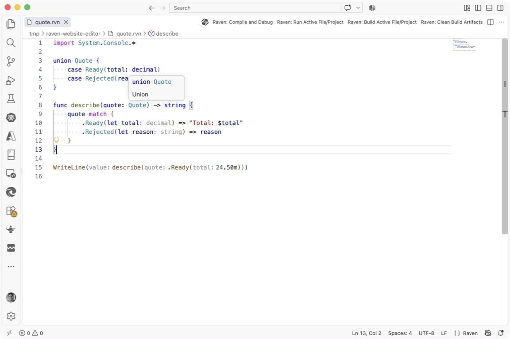

<section class="raven-hero">
  

    
Raven programming language

    <h1>A fresh language for .NET.</h1>
    
Expressive functions, explicit data models, and familiar object-oriented programming—with the .NET libraries and tools you already use.

    

      <a class="raven-button raven-button-primary" href="https://marinasundstrom.github.io/raven/playground/?example=hello">Try Raven</a>
      <a class="raven-button" href="getting-started.md">Install the SDK</a>
    

    
<a href="introduction.md">Take the language tour</a> · <a href="status.md">Preview status and compatibility</a>

    <ul class="raven-capabilities" aria-label="Available today">
      <li>.NET 10 &amp; 11</li><li>SDK &amp; templates</li><li>VS Code</li><li>Compiler APIs</li>
    </ul>
  

  

    
Explicit states · quote.rvn

<pre><code class="lang-raven">import&#32;System.Console.*&#10;&#10;union&#32;Quote&#32;{&#10;&#32;&#32;&#32;&#32;case&#32;Ready(total:&#32;decimal)&#10;&#32;&#32;&#32;&#32;case&#32;Rejected(reason:&#32;string)&#10;}&#10;&#10;func&#32;describe(quote:&#32;Quote)&#32;-&gt;&#32;string&#32;{&#10;&#32;&#32;&#32;&#32;quote&#32;match&#32;{&#10;&#32;&#32;&#32;&#32;&#32;&#32;&#32;&#32;.Ready(let&#32;total)&#32;=&gt;&#32;&quot;Total:&#32;$total&quot;&#10;&#32;&#32;&#32;&#32;&#32;&#32;&#32;&#32;.Rejected(let&#32;reason)&#32;=&gt;&#32;reason&#10;&#32;&#32;&#32;&#32;}&#10;}&#10;&#10;WriteLine(describe(.Ready(24.50m)))&#10;</code></pre>
    
Declare the possible states. Match each one.

  

</section>

<section class="raven-learning-path">
  

    
From first look to first program

    <h2>Start with something that runs.</h2>
  

  <ol class="raven-path-steps">
    <li>1<a href="raven-in-60-seconds.md">Meet the language</a>
Read one complete program, then change it in your browser.
</li>
    <li>2<a href="getting-started.md">Install and run</a>
Download the SDK and run your first file. No source checkout required.
</li>
    <li>3<a href="introduction.md">Learn the ideas</a>
Explore functions, records, unions, patterns, and .NET interop.
</li>
  </ol>
  
Already write C#? Start with <a href="raven-for-csharp-developers.md">familiar code, expressed in Raven</a>.

</section>

<section class="raven-feature-section">
  

Readable workflows
<h2>Make absence and failure explicit.</h2>
<code>Option</code> represents absence; <code>Result</code> carries a success or an error. Propagate with <code>?</code> when the current operation cannot continue, or use <code>match</code> to handle each case.

<a href="lang/features/option-and-result.md">Learn Option and Result</a>

  

<pre><code class="lang-raven">import&#32;System.Console.*&#10;&#10;func&#32;readPort(text:&#32;string)&#32;-&gt;&#32;Option&lt;int&gt;&#32;{&#10;&#32;&#32;&#32;&#32;let&#32;port&#32;=&#32;int.TryParse(text)?&#10;&#32;&#32;&#32;&#32;if&#32;port&#32;&lt;=&#32;0&#32;||&#32;port&#32;&gt;&#32;65535&#32;{&#32;return&#32;.None&#32;}&#10;&#32;&#32;&#32;&#32;return&#32;.Some(port)&#10;}&#10;&#10;WriteLine(readPort(&quot;8080&quot;))&#10;WriteLine(readPort(&quot;invalid&quot;))</code></pre>

</section>

<section class="raven-feature-section">
  

The platform you know
<h2>Use ordinary .NET libraries.</h2>
Call .NET APIs, use generic collections and LINQ, and build with NuGet and MSBuild. Raven also supports classes, interfaces, inheritance, and async methods.

<a href="lang/features/dotnet-interop.md">Explore .NET interoperability</a>

  

<pre><code class="lang-raven">import&#32;System.*&#10;import&#32;System.Linq.*&#10;import&#32;System.Console.*&#10;&#10;let&#32;names&#32;=&#32;[&quot;raven&quot;,&#32;&quot;dotnet&quot;,&#32;&quot;hello&quot;]&#10;let&#32;titles&#32;=&#32;names&#10;&#32;&#32;&#32;&#32;.Where(name&#32;=&gt;&#32;name.Length&#32;&gt;&#32;4)&#10;&#32;&#32;&#32;&#32;.Select(name&#32;=&gt;&#32;name.ToUpperInvariant())&#10;&#10;WriteLine(String.Join(&quot;,&#32;&quot;,&#32;titles))</code></pre>

</section>

<section class="raven-tooling">
  

A complete working environment
<h2>Write, run, and understand your code.</h2>
The SDK, editor extension, and compiler services share the same language implementation.

  

    
<h3>SDK and templates</h3>
Create console apps, libraries, and web projects. Build and run them with <code>rvn</code>.
<a href="getting-started.md">Install the SDK</a>

    
<h3>VS Code</h3>
Completion, diagnostics, hover, navigation, and refactorings while you edit.
<a href="compiler/raven-vscode-extension.md">Set up the extension</a>

    
<h3>Compiler services</h3>
Work with syntax trees, symbols, and semantic models. Extend analysis with analyzers and source generators.
<a href="compiler/index.md">Explore the tools and APIs</a>

  

  <figure class="raven-editor-figure">
    
    <figcaption>Raven in VS Code, with symbol hover information and compiler-backed type hints.</figcaption>
  </figure>
</section>

<section class="raven-web-showcase">
  

Build an application
<h2>An ASP.NET Core API, in Raven.</h2>
The pet-shelter sample combines routing, OpenAPI, async handlers, and streaming responses with Raven records and unions.
<a class="raven-button raven-button-primary" href="workloads/web-api.md">Build the web API</a>

  

<strong>More places to explore</strong><a href="workloads/embedded-iot.md">Embedded IoT</a> and <a href="workloads/iot-monitor.md">Native AOT</a>

<strong>Experimental</strong><a href="showcases/html-components.md">Blazor component macros</a> · evolving syntax and tooling

</section>

<section class="raven-reference-callout">
<strong>Raven is in preview.</strong> Use the <a href="status.md">release and compatibility guide</a> to distinguish available releases from upcoming language changes.
</section>
